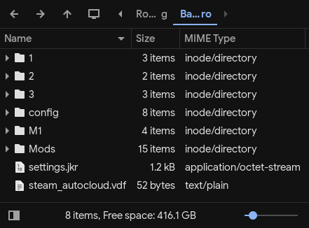

# Installation

1. Clone this repository into Balatro's game directory.

   - `%AppData%/Balatro/Mods` on Windows.
   - `~/.steam/steam/steamapps/compatdata/2379780/pfx/drive_c/users/steamuser/AppData/Roaming/Balatro` on Steam Deck/Linux default directory (`~/` will be called _Home_ if you are moving files in the GUI file manager).
   - Flatpak version of Steam: `~/.var/app/com.valvesoftware.Steam/.steam/steam/steamapps/compatdata/2379780/pfx/drive_c/users/steamuser/AppData/Roaming/Balatro`.

2. Name the cloned directory `Mods`.

   - Steam Deck/Linux users can use this command to clone the repository:

   ```sh
   git clone https://git.vomitblood.com/Vomitblood/balatro-mods.git Mods
   ```

   - Balatro game directory should look like this:  
     

3. Right click on Balatro in your Steam library.
4. Manage > Browse local files.
5. Move `version.dll` from this repository to this directory.
6. Copy and paste this into the launch options of Balatro in Steam:

```
WINEDLLOVERRIDES="version=n,b" %command%
```

7. Profit.
